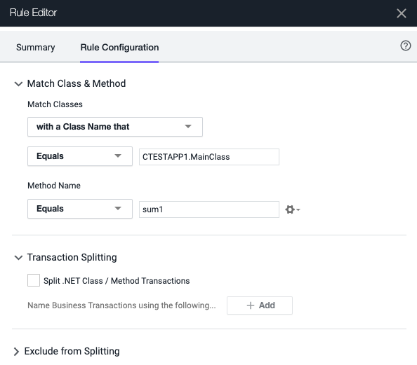
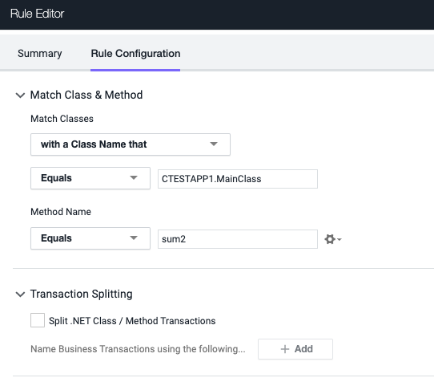
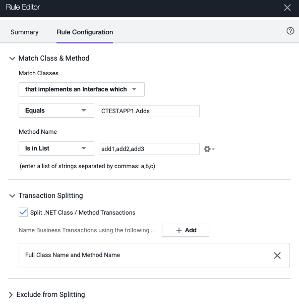
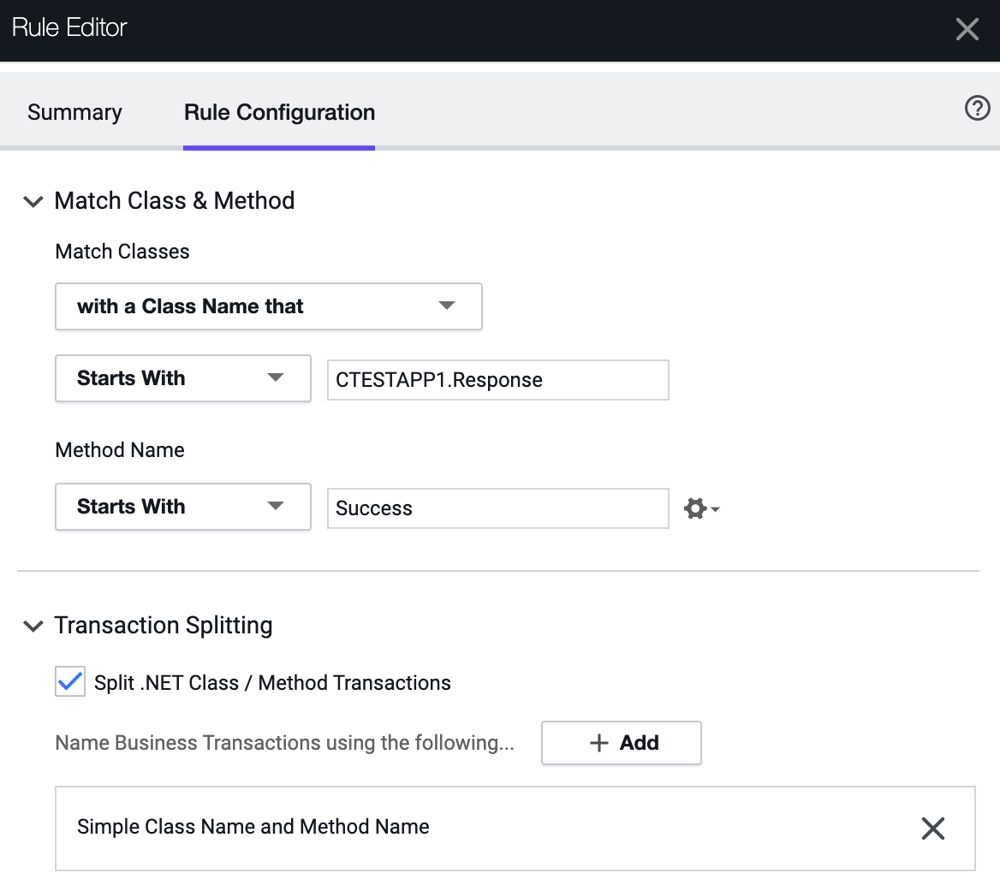
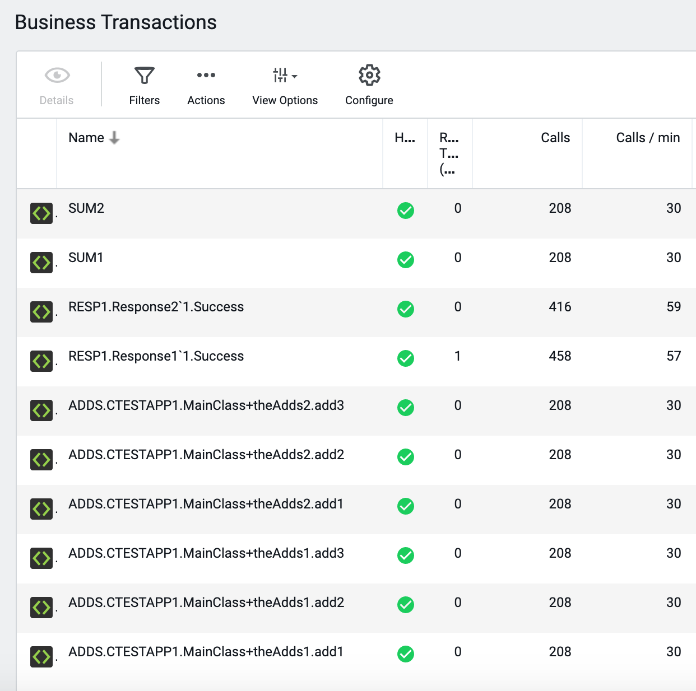

# C-TEST-APP1

The repository is a Visual Studio project and should open in VS and compile to C-TEST-APP-1/bin/Debug/C-TEST-APP-1.exe .

An AppDynamics   .Net agent config.xml is included.

# BT Detection Rules

# BT Detection on Classes that equal CTESTAPP1.mainClass and Method sum1

# BT Detection on Classes that equal CTESTAPP1.mainClass and Method sum2

# BT Detection on Classes that implement the interface CTESTAPP1.Adds, with the BTs being named using the full class and method name

# BT Detection on Classes and Methods that start with Response and Success respectively, with the BTs being named using simple class and method name

# BT Detected using the above rules

# Next

